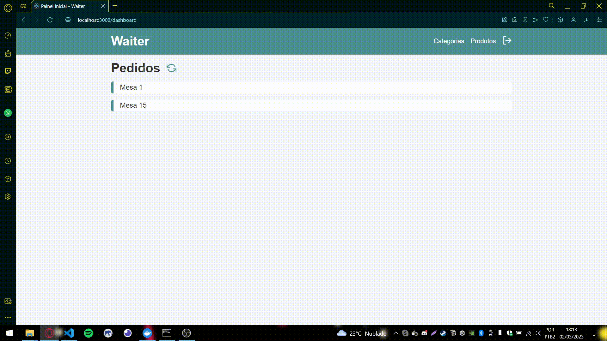
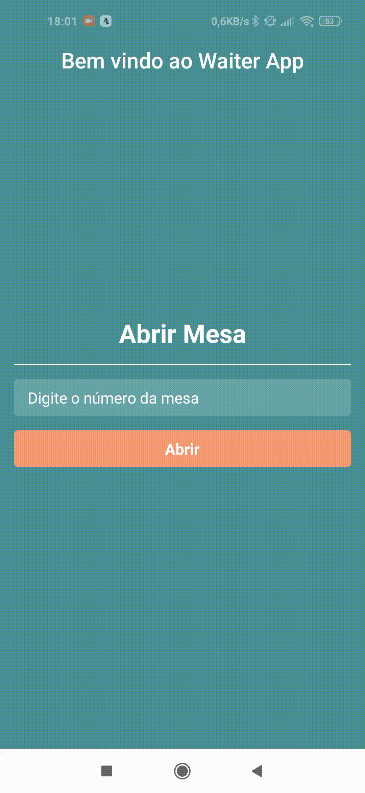

# Waiter

Hello There!

This is a Waiter Application to make easy the communication between waiter and kitchen.

The waiter can save the order in the smartphone and then this order will show up in the browser that should stay inside the kitchen.

> Web Version

>App 

## How it works?

The project were built using Docker. So, to make it works check if you have Docker installed and running in your local machine.

> API

I've used MongoDB with Mongoose as ORM and Typescript, I have a MongoDB Container inside the docker-compose.yml file.

Create a <strong>.env</strong> file in the root of the project and create the following envs variables:

<ol>
  <li>PORT=3333</li>
  <li>MONGO_PORT=27017</li>
</ol>

Now, inside the api folder, create another <strong>.env</strong> file and put inside this envs variables:

<ol>
  <li>PORT=3333</li>
  <li>MONGO_URL="mongodb://waiter_mongo:27017/waiter"</li>
</ol>

Now, install the dependencies, run:
<ul>
  <li><strong>yarn</strong> or <strong>npm install</strong></li>
</ul>

After the installation just run in the root of the project:    <strong>docker-compose up --remove-orphans</strong>  

If all it's working if you access in your browser <strong>http://localhost:3333/ping</strong> you should see the success message.

> WEB - Frontend

The main stack here is Next.js and Axios to consuming the API all the project build with Typescript.

Inside the frontend folder just run <strong>yarn</strong> and it is going to be enough to work.

Access <strong>http://localhost:3000</strong>

> MOBILE - App

Ok, inside the app folder, you're going to need Expo installed so run <strong>npm i -g @expo/cli</strong> if you don't have Expo installed.
Now, run <strong>yarn</strong> or <strong>npm install</strong> to install the package.json dependencies.

Then, inside src/services/api.ts change the BASE_URL to your IP Address, example http://192.168.0.1:3333 -> We use this variable to configure our api file and use it to consuming properly the API with an Emulator or Smartphone.

Run expo start

Press a to open the app in a local emulator or open the Expo Go App in your smartphone and scan the QR Code.
